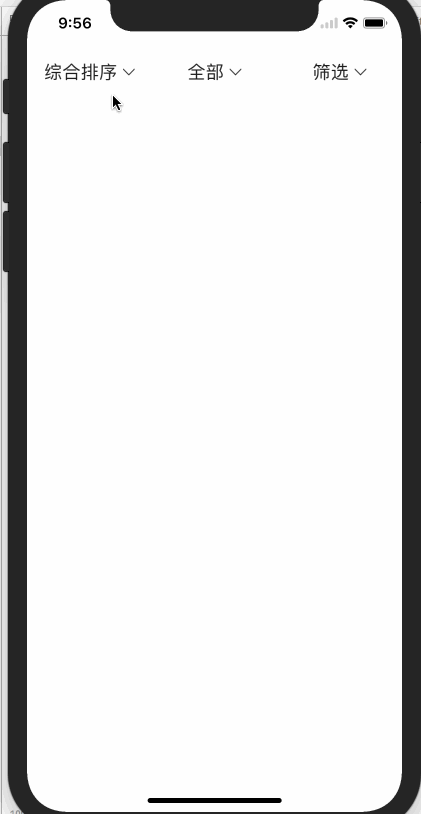
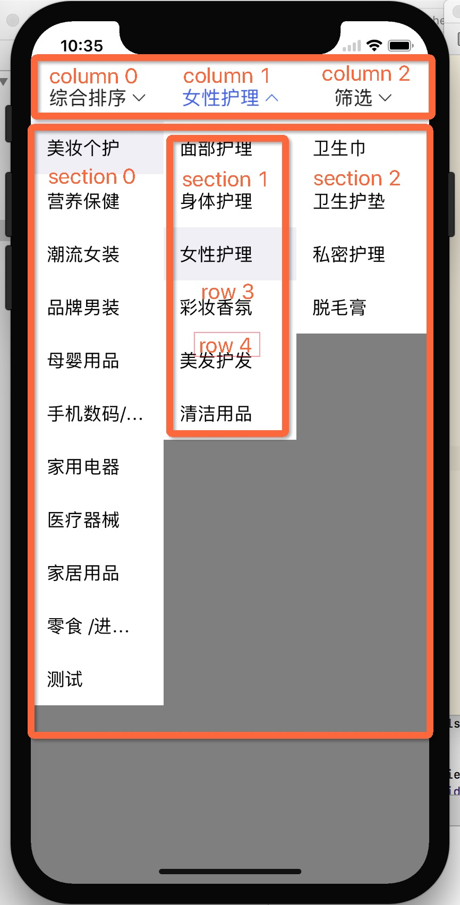

# GXComboBox
- 一个支持（1-n）级下拉筛选组件

# Contents


# How to use GXComboBox
- Installation with CocoaPods: `pop 'GXComboBox'`
- Manual import:
    - Drag All files in the `GXComboBox` folder to project

- GXComboBox use is like UITableView

```
comboBoxView.delegate = self
comboBoxView.dataSoure = self
```

```
// MARK: GXComboBoxViewDataSoure
protocol GXComboBoxViewDataSoure {
    
    /// 在这里注册每个TableView Cell
    ///
    /// - Parameters:
    ///   - comboBoxView: comboBoxView
    ///   - column: 列数
    ///   - section: 第几个TableView
    ///   - tableView: TableView
    /// - Returns: void
    func comboBoxView(_ comboBoxView: GXComboBoxView, numberOfSectionInColumn column: Int, section: Int, regiseCell tableView: UITableView)
    
    /// 获取列数
    ///
    /// - Parameters:
    ///   - comboBoxView: comboBoxView
    /// - Returns: 列数（顶部按钮多少个）
    func numberOfColumn(in comboBoxView: GXComboBoxView) -> Int
    
    /// 获取列对应的tableView个数
    ///
    /// - Parameters:
    ///   - comboBoxView: comboBoxView
    ///   - column: 列数
    /// - Returns: tableView个数
    func comboBoxView(_ comboBoxView: GXComboBoxView, numberOfSectionInColumn column: Int) -> Int

    /// 获取每个tableview row个数
    ///
    /// - Parameters:
    ///   - comboBoxView: comboBoxView
    ///   - column: 列数
    ///   - section: 第几个TableView
    /// - Returns: row
    func comboBoxView(_ comboBoxView: GXComboBoxView, numberOfRowsInColum column: Int, section: Int) -> Int

    /// 获取cell
    ///
    /// - Parameters:
    ///   - comboBoxView: comboBoxView
    ///   - indexPath: indexPath
    /// - Returns: cell
    func comboBoxView(_ comboBoxView: GXComboBoxView, cellForRowAt indexPath: GXIndexPath) -> UITableViewCell
    
    /// 按钮的标题
    ///
    /// - Parameters:
    ///   - comboBoxView: comboBoxView
    ///   - column: 列数
    /// - Returns: 按钮标题
    func titleOfColumn(_ comboBoxView: GXComboBoxView, numberOfColumn column: Int) -> String
}

// MARK: GXComboBoxViewDelegate
protocol GXComboBoxViewDelegate {
    
    /// cell height
    ///
    /// - Parameters:
    ///   - comboBoxView: comboBoxView
    ///   - indexPath: indexPath
    /// - Returns: cell height
    func comboBoxView(_ comboBoxView: GXComboBoxView, heightForRowAt indexPath: GXIndexPath) -> CGFloat
    
    /// cell click
    ///
    /// - Parameters:
    ///   - comboBoxView: comboBoxView
    ///   - indexPath: indexPath
    func comboBoxView(_ comboBoxView: GXComboBoxView, didSelectedRowAt indexPath: GXIndexPath)
}
```
# GXIndexPath

```
class GXIndexPath {
    /// 列 （顶部按钮tag 0，1，2...）
    var column: Int
    /// 第几个tableview
    var section: Int
    /// 第几行
    var row: Int
    
    init(row: Int, section: Int, column: Int) {
        self.section = section
        self.row = row
        self.column = column
    }
}
```


# See the GXComBoBoxDemo for more details

# Licence
MIT


